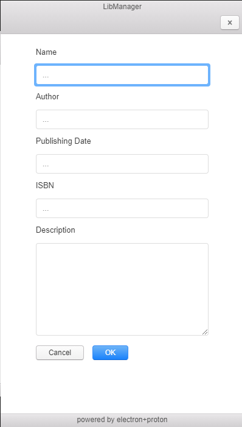

## Name generator

Electron based GUI App for Library Management.

### Description
This app allows users to add/delete books.
It consists of two windows. Data is saved as JSON.

#### GUI 
#### Main Window

  

#### Add Book Window

  

#### TODO
1. add opportunity for users to add covers to the books
### License
MIT
